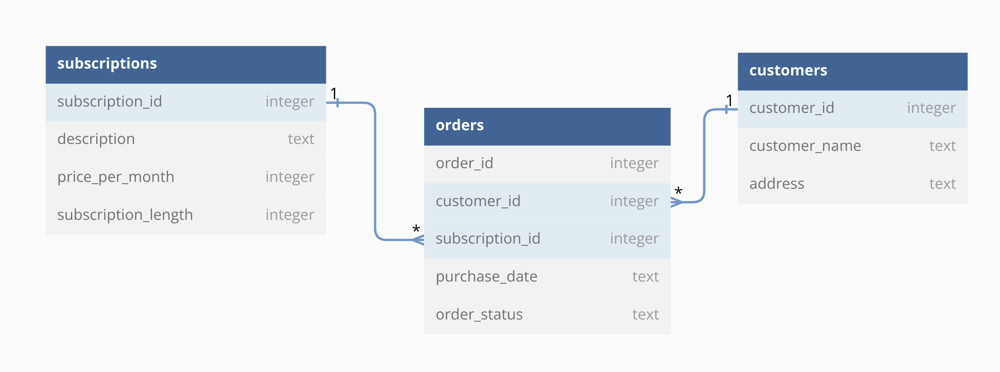

# Fashion Magazines
Code Louisville Data Analysis Exercise

## Overview

In this exercise we will write a SQL query against a database of magazine 
subscriptions. This exercisee is based on the Codecademy "Multiple Tables" 
lesson.

### Schema

### Table: customers
| column | type | constraint |
| ------ | ---- | ---------- |
| customer_id | INTEGER | PRIMARY KEY |
| customer_name | TEXT | NOT NULL |
| address | TEXT | NOT NULL |

### Table: subscriptions
| column | type | constraint |
| ------ | ---- | ---------- |
| subscription_id | INTEGER | PRIMARY KEY |
| description | TEXT | NOT NULL |
| price_per_month | INTEGER | NOT NULL |
| subscription_length | INTEGER | NOT NULL |

### Table: orders
| column | type | constraint |
| ------ | ---- | ---------- |
| order_id | INTEGER | PRIMARY KEY |
| customer_id | INTEGER | FOREIGN KEY |
| subscription_id | INTEGER | FOREIGN KEY |
| purchase_date | TEXT | NOT NULL |
| order_status | TEXT | NOT NULL |

### Requirements

Write a SQL query that returns the customer name and total amount due for the 
customers that have unpaid Fashion Magazine subscriptions. Note that the column 
names in the resulting file need to match the column names in the example below.

Hints
- Build the query piece by piece 
- Start with the orders table and work out from there.
- Filter the orders table on the `orders.order_status` column
- Join the customers table to the orders table to get the customer's name
- Join the subscriptions table to the orders table as to get the number of 
months and subscription length
- filter the orders on the `subscriptions.description` column
- Multiply the subscirption price with the subscription length to get the total 
amount due
- Format the total amount due as currency using the `PRINTF()` function
- Group By Cuustomer and sum the amount due to account for customers that have 
more than one unpaid Fashion Magazine subscriptions

### Example Output

| Customer | Amount Due |
| -------- | ---------- |
| Bethann Schraub | $102.00 |
| Eryn Vilar | $102.00 |
| Janay Priolo | $57.00 |
| Lizabeth Letsche | $237.00 |

## Insructions

1. Clone the repo to your machine.
1. Create and activate a virtual environment and install the packages listed in the 
`requirements.txt` file. (instructions below)
1. Add your SQL query to the `sql/fashion_magazines.sql` file.
1. Run the `run_sql.py` script. This script will execute your query against the
database and save the results to `data/fashion_magazines.csv`.
1. Test your code by running the automated tests `pytest tests.py`. 
(instructions below)
1. Add, Commit, and Push your `sql/fashion_magazines.sql` and 
`data/fashion_magazines.csv` files back to GitHub.

###  Virutal Environment Instructions

1. After you have cloned the repo to your machine, navigate to the project 
folder in GitBash/Terminal.
1. Create a virtual environment in the project folder. 
1. Activate the virtual environment.
1. Install the required packages. 
1. When you are done working on your repo, deactivate the virtual environment.

Virtual Environment Commands
| Command | Linux/Mac | GitBash |
| ------- | --------- | ------- |
| Create | `python3 -m venv venv` | `python -m venv venv` |
| Activate | `source venv/bin/activate` | `source venv/Scripts/activate` |
| Install | `pip install -r requirements.txt` | `pip install -r requirements.txt` |
| Deactivate | `deactivate` | `deactivate` |

### Automated Testing

This repo contains a small testing program that is automatically run by GitHub 
to validate your code. This testing program is contained in the tests.py file. 
You don't have to do anything with this file to complete the exercise, but you 
can follow these steps if you would like to run the tests on your machine.

1. Open GitBash in Windows or the Terminal in Mac and navigate to the project 
folder.
1. Make sure that the virtual environment is active.
1. Use the following command to run the tests: `pytest tests.py`. 
1. Review the output from running the test. This will let you know whether your 
code produces the expected results. You can 
[read about the pytest output here](https://docs.pytest.org/en/7.1.x/how-to/output.html).